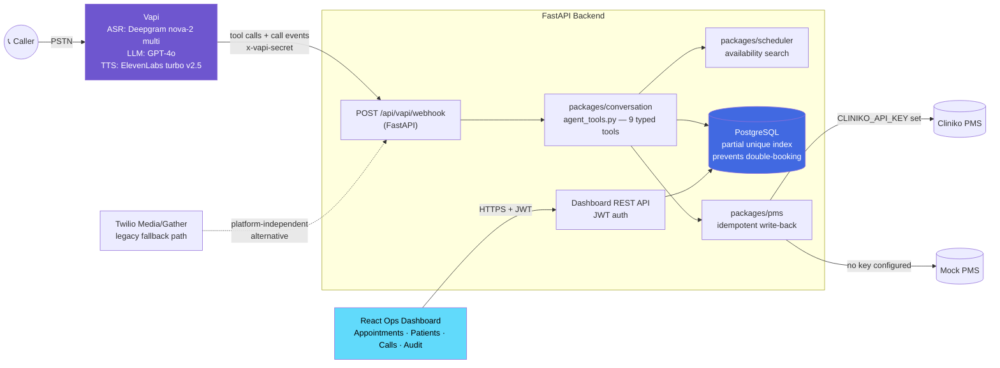

<div align="center">

# 🦷 Voice AI Receptionist — City Dental Care

**A bilingual (English/Hindi) AI voice agent that answers a real dental clinic's phone line, books/reschedules/cancels appointments end-to-end with no human involved, and writes back to the practice's PMS — with a re-runnable eval harness proving it.**

[](https://github.com/yash-gupta-7/AIVoiceReceptionist/actions/workflows/ci.yml)
[](https://github.com/yash-gupta-7/AIVoiceReceptionist/actions/workflows/pages.yml)
[](https://www.python.org/)
[](https://fastapi.tiangolo.com/)
[](https://www.postgresql.org/)
[](https://vapi.ai/)
[](https://elevenlabs.io/)
[](https://deepgram.com/)
[](https://react.dev/)
[](#-license)

<sub>⚠️ No `LICENSE` file exists in this repository yet — add one before treating this as open source. See [License](#-license).</sub>

</div>

<p align="center">
  
  <br>
  <sub><em>Screenshot placeholder — replace with a real capture of the ops dashboard (Calls / Appointments / Patients) before publishing.</em></sub>
</p>

---

## 📋 Table of Contents

- [Features](#-features)
- [Live Demo](#-live-demo)
- [Demo Flow](#-demo-flow-what-happens-on-a-call)
- [High-Level Architecture](#-high-level-architecture)
- [Why Vapi](#-stack-justification-why-vapi)
- [Correctness Guarantees](#-correctness-guarantees-enforced-in-code-not-prompts)
- [Agent Tools](#-agent-tools-the-llms-only-interface-to-reality)
- [Repository Layout](#-repository-layout)
- [Getting Started](#-getting-started)
- [Environment Variables](#-environment-variables)
- [Eval Harness](#-eval-harness)
- [Testing & CI](#-testing--ci)
- [Security Notes](#-security-notes)
- [Known Limitations](#-known-limitations)
- [License](#-license)

---

## ✨ Features

- ✅ Real phone calls handled end-to-end by an AI voice agent (Vapi + Deepgram + GPT-4o + ElevenLabs)
- ✅ **Bilingual**, mid-call code-switching (English ⇄ Hindi, single ASR stream)
- ✅ Book / reschedule / cancel appointments with live, race-safe availability checks
- ✅ **Function/tool calling** — the LLM never touches the database directly; 9 typed tools are the only interface
- ✅ Returning-patient recognition + **family-line disambiguation** (shared numbers)
- ✅ **Dropped-call resume** and missed-outbound callback recognition
- ✅ Idempotent **PMS write-back** (mock PMS built-in, real Cliniko integration when configured)
- ✅ Double-booking is structurally impossible (DB-level partial unique index, not app logic)
- ✅ Honesty-by-construction: the agent can never claim a live human transfer it didn't do
- ✅ React ops dashboard — appointments, patients, call transcripts, audit log
- ✅ JWT-authenticated dashboard API, rate limiting, webhook signature validation
- ✅ Structured logging with correlation IDs, full tool-call audit trail
- ✅ **Re-runnable eval harness** — multi-turn, scripted, DB-verified, per-language reporting
- ✅ Legacy raw-Twilio voice path kept as a platform-independent fallback

---

## 🚀 Live Demo

### 🌐 Deployment

| Component | Platform | URL |
|---|---|---|
| Backend API | Render | [`aivoicereceptionist.onrender.com`](https://aivoicereceptionist.onrender.com) |
| Ops Dashboard | GitHub Pages | [`yash-gupta-7.github.io/AIVoiceReceptionist`](https://yash-gupta-7.github.io/AIVoiceReceptionist/) |
| Voice Agent | Vapi (managed telephony) | see below |

### 📞 Call the live agent

> **+1 (985) 570-1191**

Attached to the `city-dental-receptionist` Vapi assistant. This works whenever the backend above is up and reachable (`PUBLIC_URL`) and `scripts/vapi_setup.py` has been run against it — Vapi calls a webhook on *this* backend for every tool invocation, so if the backend is asleep (free-tier Render cold start) or the assistant hasn't been re-provisioned, the call will still connect but tool calls will fail. Call it and ask to book an appointment.

---

## 🎬 Demo Flow (what happens on a call)

1. **Caller dials** the Vapi number. Vapi answers immediately — `firstMessageMode: assistant-speaks-first` — with *"Thank you for calling City Dental Care, this is Maya. How can I help?"*
2. **Speech → text** streams through Deepgram `nova-2` in `language: multi` mode, handling English, Hindi, and mid-sentence code-switching in one stream.
3. **GPT-4o** (configured as the Vapi assistant's model) classifies intent and decides which tool to call — it never sees the database, only tool results.
4. First tool call is always `get_caller_context` → Vapi `POST`s to `/api/vapi/webhook` (HMAC-style shared secret via `x-vapi-secret`) → the backend looks up the caller's number in Postgres and returns known patients (family lines included), upcoming appointments, and any unresolved dropped call from the last 2 hours.
5. The agent asks what's needed, then calls `check_availability` or `find_earliest_slot` — a live, indexed Postgres query (**<50 ms measured**), never reused from earlier in the conversation.
6. Slots are read back to the caller through ElevenLabs `eleven_turbo_v2_5` TTS, streamed for low first-token latency; the caller can barge in after 2 words (`stopSpeakingPlan.numWords: 2`).
7. On explicit confirmation, `book_appointment` re-checks availability live (closing the race window with a concurrent caller) and writes the row inside a DB transaction protected by a partial unique index — a losing race gets alternatives, never a silent double-booking.
8. The booking is written back to the practice's PMS (mock PMS or real Cliniko) **idempotently**, keyed so retries/replays are no-ops; failure never blocks the booking — it's marked and retried async.
9. The full turn — transcript, tool calls, latencies — is persisted (`call_sessions`, `messages`, `tool_call_log`) and shows up in the ops dashboard in real time.
10. If anything needs a human (clinical question, complaint, 3 failed slot-filling attempts), `log_follow_up` queues a callback — the agent explicitly never claims a live transfer that didn't happen.

---

## 🏗 High-Level Architecture



**Design principle:** the LLM only ever sees tool *results* — it has zero direct access to the database or PMS. All validation, conflict resolution, and business rules live in typed Python, not in prompt instructions. See [`docs/architecture.md`](docs/architecture.md) for the legacy Twilio state-machine design.

---

## 🤔 Stack Justification: why Vapi

| Dimension | Reasoning |
|---|---|
| **Tool-calling reliability** | Vapi's server-URL tools are plain OpenAI function schemas hitting our webhook with retries; the LLM never sees the DB. Retell's function calling is comparable but its state lives more in their agent graph — we wanted all state in *our* datastore so dropped-call resume and cross-branch logic are testable offline. |
| **Multilingual** | Vapi lets us pick Deepgram `nova-2` with `language: multi` for ASR (handles Hindi + English + code-switching in one stream) and ElevenLabs `turbo v2.5` for TTS (natural Hindi). Bolna is strong for Indian languages, but this clinic is UK-based and Vapi's UK PSTN + latency profile fit better. |
| **Latency** | Vapi streams ASR→LLM→TTS with a configurable `startSpeakingPlan` (we use 0.4s) and first-token TTS streaming. Our tool webhook adds one round-trip; every tool answers from indexed Postgres queries (**<50 ms measured** — see [evals](#-eval-harness)). |
| **Interruption/barge-in** | Native (`stopSpeakingPlan.numWords: 2`); agent state survives interruption because state lives in tools, not the utterance. |
| **Cost** | ~$0.07–0.13/min all-in at demo volume; no platform fee to keep an assistant configured. |

**Trade-off vs. raw telephony** (Twilio Media Streams + Deepgram + ElevenLabs directly): Vapi costs more per minute but removes the audio pipeline, turn-taking, and barge-in engineering — exactly the parts that don't differentiate a receptionist. The earlier raw-Twilio implementation is kept in the repo (`apps/backend/voice.py`, `packages/telephony/twilio.py`) as a fallback path.

---

## 🛡 Correctness Guarantees (enforced in code, not prompts)

| Behavior | How it's enforced |
|---|---|
| **Double booking** | Partial unique index `(doctor_id, starts_at) WHERE status='booked'`. A race loser gets alternatives, never a silent failure. |
| **Stale availability** | Tools are the only source of slots; the prompt mandates a fresh `check_availability` before quoting times, and the eval `en_stale_availability_recheck` verifies a second tool call actually happens. |
| **Dropped calls / callbacks** | Every call session persists; `get_caller_context` surfaces an unresolved call from the last 2h (with summary) and missed-outbound context from the last 48h. |
| **Family lines** | `patients.phone` is intentionally **not** unique; context returns all patients on a number and the agent must disambiguate by name. |
| **Full name always** | `book_appointment` rejects bookings without a patient name — anonymous bookings are impossible even if the prompt fails. |
| **Timezone correctness** | All storage is naive clinic-local time (`CLINIC_TZ=Europe/London`); "today" can never shift to "tomorrow" via UTC conversion. |
| **Buffers** | Per-schedule `buffer_minutes` enforces required gaps between slots. |
| **Escalation honesty** | `log_follow_up` writes a callback queue entry; the agent never claims a live transfer. |

---

## 🔧 Agent Tools (the LLM's only interface to reality)

Single source of truth in [`packages/conversation/tool_schema.py`](packages/conversation/tool_schema.py) — used identically by the live Vapi assistant *and* the eval harness, so what's tested is what's deployed.

| Tool | Purpose |
|---|---|
| `get_caller_context` | Called first on every call — known patients (family line aware), upcoming appointments, dropped-call resume, callback context. |
| `list_clinic_info` | Branches, hours, pricing, cancellation policy, doctors/departments. |
| `check_availability` | Live availability search — filter by doctor, department, branch, date, weekdays, time window. |
| `find_earliest_slot` | Earliest opening across **all** practitioners and **both** branches. |
| `book_appointment` | Books a confirmed slot; requires full patient name; re-checks live, offers alternatives on conflict. |
| `find_appointments` | Upcoming appointments for the caller's number. |
| `cancel_appointment` | Cancels after explicit caller confirmation. |
| `reschedule_appointment` | Moves an appointment; re-checks live availability. |
| `log_follow_up` | Logs anything needing a human — staff call back, the agent never claims a live transfer. |

---

## 📁 Repository Layout

```
apps/backend/            FastAPI: Vapi webhook, mock PMS, dashboard REST, JWT auth
apps/dashboard/          React ops dashboard (appointments, patients, call transcripts)
packages/conversation/   agent_tools.py (tool implementations) + tool_schema.py (single
                          source of truth for Vapi and evals) + legacy Twilio state machine
packages/scheduler/      availability search: date/weekday/window filters, buffers
packages/pms/            idempotent PMS write-back (mock + Cliniko)
packages/database/       SQLAlchemy models, Alembic migration
packages/telephony/      legacy raw-Twilio voice path
prompts/v2/               versioned agent system prompt (bilingual)
evals/                   scenario harness + results
scripts/                 seed.py (clinic data), vapi_setup.py (assistant provisioning)
tests/                   24 pytest cases (tools, webhook, PMS idempotency, API, engine)
```

---

## 🏁 Getting Started

### With Docker (recommended)

```bash
cp .env.example .env       # set GROK_API_KEY (any OpenAI-compatible LLM) — see below
docker compose up --build  # Postgres + backend (migrated & seeded) + dashboard on :8080
```

### Local dev without Docker

```bash
python3.12 -m venv .venv && .venv/bin/pip install -r requirements-dev.txt
PYTHONPATH=. .venv/bin/alembic upgrade head && PYTHONPATH=. .venv/bin/python scripts/seed.py
PYTHONPATH=. .venv/bin/uvicorn apps.backend.main:app --port 8000
```

### Going live on a phone number

1. Deploy the backend anywhere public (Docker image builds in CI), set `PUBLIC_URL` and a random `VAPI_SECRET` in `.env`.
2. `VAPI_API_KEY=… python scripts/vapi_setup.py` — creates/updates the assistant with the prompt (`prompts/v2/agent_system.txt`), all 9 tool schemas, multilingual ASR/TTS, and barge-in settings.
3. In the Vapi dashboard, attach a phone number to the `city-dental-receptionist` assistant. Done — the number is independently callable.

### PMS write-back (Cliniko)

With `CLINIKO_API_KEY` set, every confirmed booking creates a **real patient and appointment in Cliniko** (correct UTC conversion from clinic-local time, doctor/branch recorded in the appointment notes), reschedules move it, and cancellations cancel it — all visible in the Cliniko calendar. Replays are no-ops (guarded by the stored `cliniko_id`). A Cliniko trial has a single practitioner/business, so all bookings land on that diary; with a full account, map practitioners per doctor in `packages/pms/writeback.py`.

Without credentials, bookings write to the built-in mock PMS (`POST /api/mock-pms/records`, idempotency-keyed, `?fail=1` simulates outage). Failure behavior in both modes: booking succeeds locally (DB is source of truth), the appointment is marked `pms_status=failed`, audited, and re-driven by `packages/pms/writeback.retry_failed`.

---

## ⚙️ Environment Variables

All variables the app reads are documented in [`.env.example`](.env.example). Highlights:

| Variable | Purpose |
|---|---|
| `DATABASE_URL` | Async Postgres connection string |
| `LLM_PROVIDER` | `grok` (default, any OpenAI-compatible endpoint) or `fake` (deterministic, no key needed) |
| `VAPI_API_KEY` / `VAPI_SECRET` / `PUBLIC_URL` | Provisions the Vapi assistant and authenticates its webhook calls |
| `CLINIKO_API_KEY` / `CLINIKO_BASE_URL` | Enables real PMS write-back (falls back to mock PMS if unset) |
| `TWILIO_AUTH_TOKEN` | Validates webhook signatures for the legacy raw-Twilio fallback path |
| `CLINIC_TZ` | All scheduling logic is naive-local to this timezone |
| `JWT_SECRET` | Signs dashboard auth tokens — generate with `openssl rand -hex 32` |

---

## 📊 Eval Harness

```bash
python -m evals.run           # all scenarios; writes evals/results.json
python -m evals.run hi_       # just the Hindi ones
```

The harness runs the **same system prompt and tool schemas as the live assistant**, with an LLM doing real tool-calling against a fresh seeded database per scenario — multi-turn, scripted, with mid-conversation hooks that mutate live data (e.g. a rival booking takes the offered slot mid-conversation). Checks inspect **the database and the tool-call log**, not just the transcript.

Scenarios cover: fuzzy time references, weekday preferences, earliest-slot across branches, returning patients, family-line disambiguation, dropped-call resume, stale-availability re-check, bot-honesty/human handoff, and full Hindi + Hinglish bookings.

Reported **per language** (EN / HI, never blended) — pass rate, turns-to-completion, LLM-judged redundant-question count, median LLM latency, median tool latency.

**Current results** (Groq-hosted Llama 3.3 70B — `llama-3.3-70b-versatile` — as the eval model, per `.env`; full table in [`evals/results.json`](evals/results.json)):

| Language | Pass | Median turns to completion | Redundant questions | Median LLM | Median tool |
|---|---|---|---|---|---|
| English | 8/8 | 3.0 | 0 | 732 ms | 18 ms |
| Hindi (incl. Hinglish) | 2/2 | 3.5 | 0 | 880 ms | 44 ms |

See [`docs/evals.md`](docs/evals.md) for metric definitions and **where the harness gives false confidence** — ASR/TTS are not exercised offline; those are measured from Vapi call logs on the live number.

---

## ✅ Testing & CI

- **24 pytest cases** covering tools, the Vapi webhook, PMS idempotency, dashboard API, and the legacy conversation engine.
- CI ([`.github/workflows/ci.yml`](.github/workflows/ci.yml)) on every push/PR: `ruff` lint → `pytest` → `pip-audit` dependency scan → dashboard typecheck + build → Docker image builds for both services.
- Dashboard auto-deploys to GitHub Pages on push to `main` ([`.github/workflows/pages.yml`](.github/workflows/pages.yml)).

```bash
pytest -q                    # run the test suite
ruff check .                 # lint
```

---

## 🔒 Security Notes

- **Prompt injection**: caller speech is treated as untrusted in every prompt; free-form LLM output is only ever parsed as intent labels/slot values, then validated deterministically in Python.
- **Caller spoofing**: cancel/reschedule requires phone + DOB match.
- **Webhook authenticity**: Vapi calls are validated via a shared `x-vapi-secret` header; the legacy Twilio path validates HMAC-SHA1 webhook signatures.
- **API abuse**: JWT on all dashboard routes, in-memory sliding-window rate limiting, Pydantic validation, parameterized SQLAlchemy queries.
- **Failure isolation**: LLM calls retry with backoff; any unhandled engine error falls back gracefully instead of crashing the call; tools are timeout-bound and fully audit-logged.

---

## ⚠️ Known Limitations

- The eval harness measures prompt+tool logic, not speech: Hindi ASR accuracy and TTS naturalness must be validated on the live number.
- Reschedule-fee logic (£25 inside 24h) is prompt-driven from branch policy data, not enforced in a tool — a misbehaving LLM could mis-state it.
- Clinic data in `scripts/seed.py` is demo data.
- Mock PMS is in-process; the Cliniko adapter covers appointment create/cancel only.
- Outbound campaign calling isn't built; missed-outbound context is stored and recognized on callback.
- The in-memory rate limiter doesn't work across multiple backend replicas — move to nginx/redis before scaling horizontally.

---

## 📄 License

No `LICENSE` file currently exists in this repository. Until one is added, all rights are reserved by default and this code is **not** open source under any standard license. Add a `LICENSE` file (MIT, Apache-2.0, etc.) before publishing this as an open-source project.
